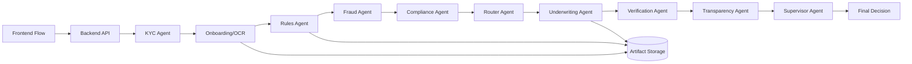

# Daksha Orchestration System

An agentic underwriting platform for loan approvals and health insurance premium recommendations. The backend runs a LangGraph workflow with EBM models, OCR, compliance rules, fraud checks, and LLM explanations. The frontend provides a guided flow from KYC to OCR, orchestration, and results.

## Quick Start

### Backend
```bash
cd backend
pip install -r requirements.txt
python main.py
```
API runs at http://localhost:8000

### Frontend
```bash
cd frontend
npm install
npm run dev
```
App runs at http://localhost:5173

## Architecture (Current)

```
KYC → Onboarding/OCR → Rules → Fraud (non-blocking) → Compliance
    → Router → Underwriting → Verification → Transparency → Supervisor → Final State
```



### Agent Responsibilities
- **KYC Agent**: Mock DigiLocker verification.
- **Onboarding Agent**: OCR extraction, confidence, prefill data, document verification.
- **Rules Agent**: Validates OCR snapshots against rule PDFs/TXT in `backend/src/rules`.
- **Fraud Agent**: OCR fraud signals (non-blocking, recorded).
- **Compliance Agent**: Regulatory checks (RAG when enabled).
- **Router Agent**: Loan/insurance/both routing.
- **Underwriting Agent**: EBM model inference for approval/premium.
- **Verification Agent**: LLM sanity check.
- **Transparency Agent**: Explanation generation.
- **Supervisor Agent**: Final decision/loopback.

## Features
- **Multi-agent workflow** with LangGraph.
- **OCR + HITL**: OCR extraction with manual review support.
- **Rules + Fraud**: PDF rule checks and fraud flags.
- **EBM models**: Explainable approval/premium prediction.
- **LLM explanations**: Layman-friendly rationale.
- **Artifact persistence**: Declared data, OCR data, derived features, validation reports, model outputs.

## Environment
Backend environment variables are in `backend/.env`.

Frontend expects:
```
VITE_API_URL=http://localhost:8000/api
```

## API Endpoints (Core)
- Auth: `/api/auth/register`, `/api/auth/login`
- Applications: `/api/applications/` (POST/GET/PUT)
- Workflow: `/api/workflow/submit/<id>`, `/api/workflow/status/<id>`, `/api/workflow/results/<id>`
- HITL: `/api/workflow/hitl/<id>`, `/api/workflow/hitl/<id>/approve`

See [backend/API_DOCUMENTATION.md](backend/API_DOCUMENTATION.md) for details.

## Storage Artifacts
Stored under `backend/storage/<app_id>/`:
- `declared_data.json`
- `ocr_extracted_data.json`
- `derived_features.json`
- `validation_report.json`
- `model_output.json`

## Project Layout
```
frontend/
  src/            # UI components/pages
backend/
  src/            # Core agents, graph, schemas, utils
  routes/         # API endpoints
  tests/          # pytest suite
  docs/           # documentation
```

## Running Tests
```bash
cd backend
pytest
```

## Notes
- `backend/src/rules` should contain regulatory PDFs/TXT used by the RulesAgent.
- `backend/src/mock_db.json` is the DigiLocker mock.
- The frontend flow is: KYC → selection → config → upload → analysis → result.
